<div align="center">


<h1>Financial Services Landing Zone (FSLZ)</h1>

<p><strong>The Global Standard for Industrialized Financial Cloud Foundations and Regulatory Governance</strong></p>

[]()
[]()
[]()
[]()

<br/>

> **"Industrializing financial cloud foundations to automate regulatory guardrails, govern risk, and accelerate digital banking transformation."** 
> Financial Services Landing Zone (FSLZ) is a flagship repository designed to enable banks, insurance firms, and fintechs to design, deploy, and govern secure cloud environments through automated controls, institutional frameworks, and multi-region reference architectures.

</div>

---

## 🏛️ Executive Summary

**Financial Services Landing Zone (FSLZ)** is a flagship repository designed for CIOs, CISOs, and Risk Leaders. As financial institutions migrate mission-critical workloads—from trading systems to customer portals—to the cloud, the ability to automate, monitor, and continuously prove compliance against PCI, SOX, and regional regulations becomes the critical foundation for security and trust.

This platform provides an industrialized approach to **Financial Cloud Governance**, delivering production-ready **Security Guardrails**, **Identity Frameworks**, **Cost Optimization Models**, and **Regulatory Reporting Workflows**. It supports **Azure**, **AWS**, and **GCP** at institutional scale, enabling organizations to transition from "Manual Audits" to "Industrialized Cloud Operations."

---

## 💡 Why Financial Landing Zones Matter

A unified financial cloud foundation is the "regulatory nervous system" of the modern bank:
- **Accelerated Time-to-Market**: Reducing the time to onboard new financial products and services through standardized landing zones.
- **Continuous Compliance**: Moving beyond "point-in-time" audits to real-time, automated monitoring of security posture.
- **Risk Transparency**: Providing a clear, institutional view of regional risks, vulnerabilities, and remediation status.
- **Institutional Governance**: Enforcing complex financial standards (e.g., PCI DSS) across every infrastructure and application component.

---

## 🚀 Business Outcomes

### 🎯 Strategic Financial Impact
- **Reduced Compliance Costs**: Automating 60%+ of the regulatory evidence collection through centralized metadata and logs.
- **Increased Engineering Agility**: Allowing product teams to deploy and scale mission-critical services faster by reducing foundation friction.
- **Enhanced Security Posture**: Enforcing technical guardrails that prevent data exfiltration and common misconfigurations.
- **Improved Stakeholder Trust**: Providing real-time, evidence-based reporting to regulators, auditors, and board members.

---

## 🏗️ Technical Stack

| Layer | Technology | Rationale |
|---|---|---|
| **Governance Engine** | Python (FastAPI) | High-performance orchestration of landing zone designs, policy mappings, and risk scoring. |
| **Automation** | Terraform + Bicep | Policy-as-Code for enforcing multi-cloud financial baselines across the estate. |
| **Frontend** | React 18, Vite | Premium portal for executive dashboards, identity governance, and cost insights. |
| **Identity Hub** | Entra ID / AWS IAM | Deep native integration with institutional identity providers for secure access. |
| **Database** | PostgreSQL | Centralized repository for entity metadata, policy evidence, and institutional artifacts. |
| **Observability** | Prometheus / Grafana | Real-time monitoring of foundation health, policy drift, and cost efficiency. |

---

## 📐 Architecture Storytelling: 95+ Diagrams

### 1. Executive High-Level Architecture
The holistic vision of the enterprise financial cloud foundation journey.

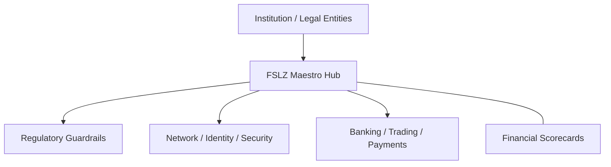

### 2. Detailed Landing Zone Topology
The internal service boundaries and management layers of the industrialized foundation.

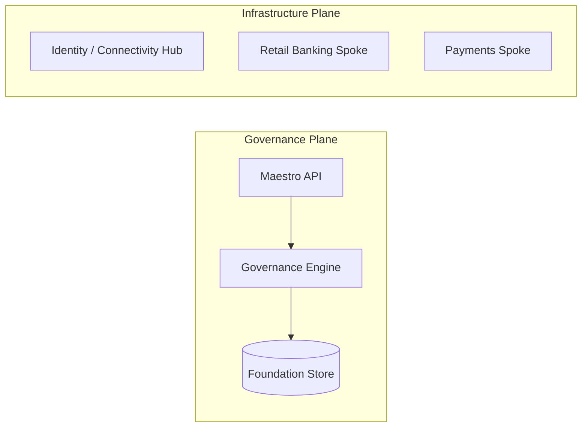

### 3. Customer to Platform Request Path
Tracing the secure path from a customer-facing app to a regulated cloud resource.

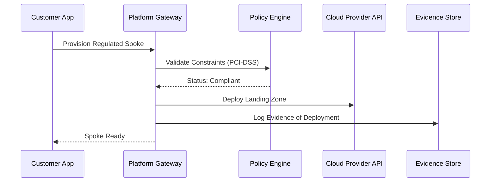

### 4. Control Plane Architecture
The "Brain" of the framework managing global institutional standards and platform-as-code.

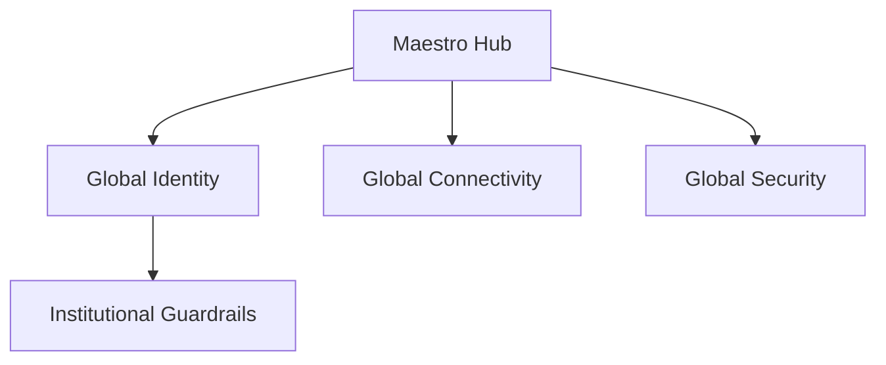

### 5. Multi-Cloud Topology
Synchronizing institutional standards across Azure and AWS for a unified financial estate.

```mermaid
graph LR
    Azure[Azure Environment] <-> Bridge[Governance Sync] <-> AWS[AWS Environment]
    Bridge <-> GCP[GCP Environment]
```

### 6. Regional Deployment Model
Hosting foundation services close to global financial hubs for performance and latency.

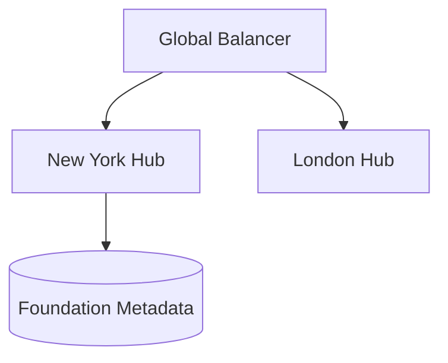

### 7. DR Failover Model
Ensuring platform continuity for critical foundation services and regulatory data.

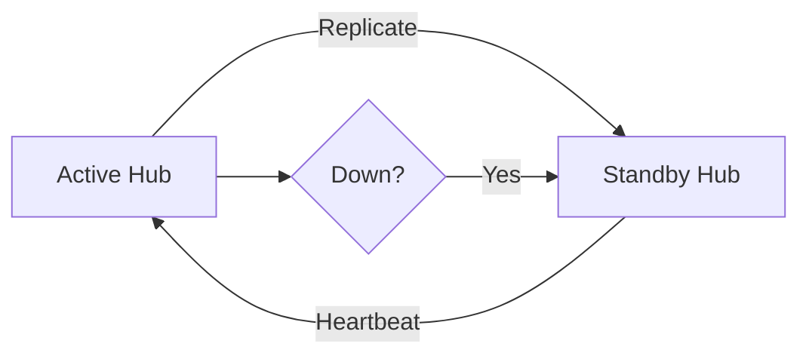

### 8. API Gateway Architecture
Securing and throttling the entry point for foundation orchestration and risk metadata.

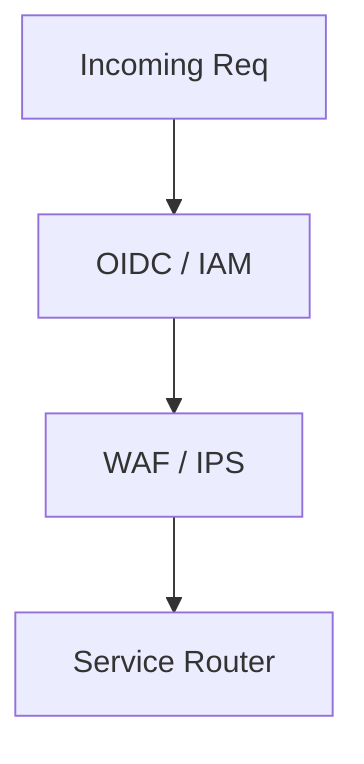

### 9. Queue Worker Architecture
Managing long-running provisioning tasks, compliance scans, and report generation.

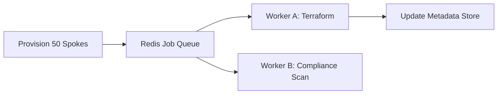

### 10. Dashboard Analytics Flow
How raw foundation telemetry becomes executive institutional readiness scorecards.

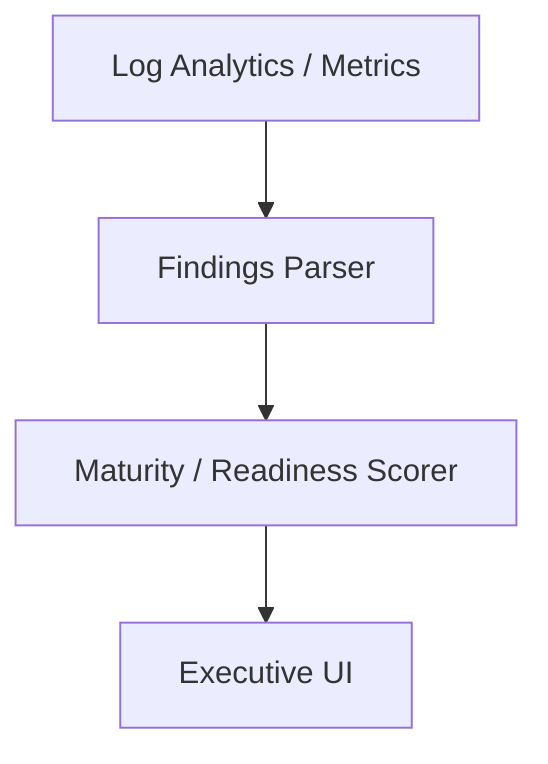

### 11. Management Group Hierarchy
Standardizing the organization of Azure subscriptions for large-scale financial entities.

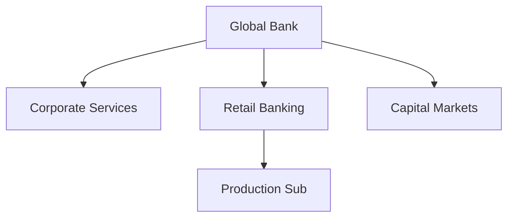

### 12. AWS Organization OU Model
Orchestrating AWS accounts into logical organizational units for policy enforcement.

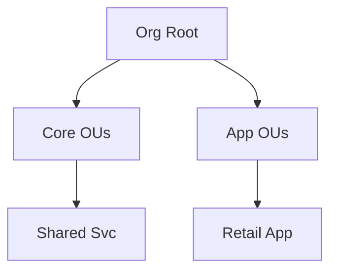

### 13. Legal Entity Segmentation
Ensuring strict isolation between different regulated financial legal entities.

```mermaid
graph LR
    EntA[Bank UK] <-> Gap[Regulatory Gap] <-> EntB[Bank US]
```

### 14. Shared Services Hub Model
Centralizing DNS, Identity, and Connectivity for all spokes in the landing zone.

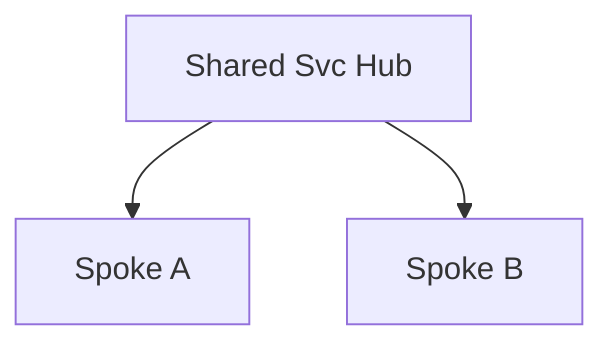

### 15. Hub-spoke Network Topology
The primary architectural pattern for secure, transitive connectivity in FSLZ.

```mermaid
graph LR
    Hub[Hub VNet] <-> SpokeA[Spoke 1]
    Hub <-> SpokeB[Spoke 2]
```

### 16. Transit Connectivity Workflow
Governing the flow of traffic between on-premises and multi-region spokes.

```mermaid
graph LR
    DC[DC] <-> ER[ExpressRoute] <-> Hub[Hub] <-> Spoke[Spoke]
```

### 17. DNS Architecture
Providing a unified, hybrid DNS resolution framework for the financial estate.

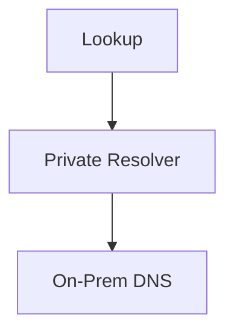

### 18. Identity Trust Boundaries
Defining where institutional identity starts and application-specific access ends.

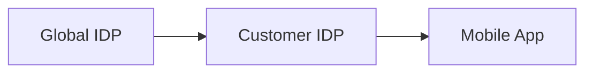

### 19. Environment Separation Model
Enforcing strict boundaries between Development, UAT, and Production enclaves.

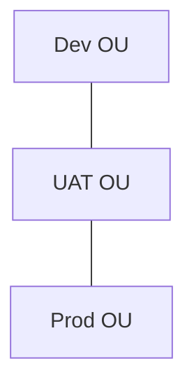

### 20. Sandbox Lifecycle Flow
Automating the creation and automated destruction of short-lived research environments.

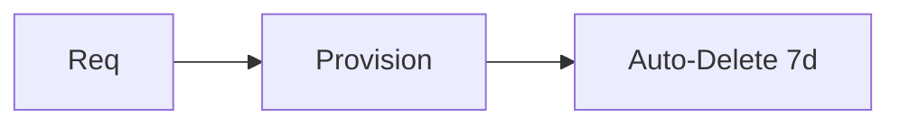

### 21. Retail Banking Platform Model
The foundation for hosting core banking services, microservices, and customer APIs.

```mermaid
graph TD
    API[Mobile API] --> Core[Core Banking] --> DB[Customer Data]
```

### 22. Payments Processing Architecture
Orchestrating secure, PCI-compliant paths for payment transaction processing.

```mermaid
graph LR
    Edge[Terminal] --> GW[Payment GW] --> Vault[Card Vault]
```

### 23. Core Banking Integration Flow
Connecting modern cloud workloads to legacy on-premises core systems of record.

```mermaid
graph LR
    Cloud[Cloud App] --> MQ[Message Queue] --> Mainframe[AS/400 / Z/OS]
```

### 24. Insurance Policy Platform Model
Architecture for managing policy lifecycles, claims, and underwriting logic.

```mermaid
graph TD
    User[Agent] --> Portal[Policy Portal] --> Engine[Rating Engine]
```

### 25. Capital Markets Trading Model
Enforcing ultra-low latency paths for institutional trading and market data feeds.

```mermaid
graph LR
    Feed[Market Data] --> Engine[Matching Engine] --> Order[Execution]
```

### 26. Wealth Management Portal Flow
Providing secure, high-availability access to portfolio management for HNW clients.

```mermaid
graph TD
    Client[Client] --> MFA[FIDO2 MFA] --> Dashboard[Portfolio View]
```

### 27. ATM / Branch Connectivity Model
Extending the landing zone connectivity to physical branch locations and ATM networks.

```mermaid
graph LR
    ATM[ATM] --> SDWAN[SD-WAN Hub] --> Cloud[Bank Hub]
```

### 28. Fraud Detection Platform
Real-time ingestion and analysis of transaction telemetry for risk mitigation.

```mermaid
graph TD
    Event[Payment Event] --> AI[Fraud AI Model] --> Alert[Block / Allow]
```

### 29. Seasonal Peak Scaling Model
Predicting and preparing for massive traffic spikes during peak financial cycles.

```mermaid
graph LR
    Normal[1x] --> Holiday[10x Scale] --> Forecast[Auto-Scale]
```

### 30. Customer Onboarding Workflow
The secure path for new digital banking customers from KYC to account activation.

```mermaid
graph LR
    Apply[Apply] --> KYC[ID Check] --> Account[Provision]
```

### 31. Enterprise Data Lake Architecture
The centralized foundation for institutional analytics, AI, and regulatory reporting.

```mermaid
graph TD
    Source[Raw Data] --> Lake[Delta Lake] --> BI[Tableau / PBI]
```

### 32. Risk Analytics Platform
Calculating institutional risk exposure across market, credit, and operational domains.

```mermaid
graph LR
    Data[Data Lake] --> HPC[Grid Compute] --> Risk[VAR Score]
```

### 33. AML Monitoring Workflow
Scanning transaction patterns for indicators of money laundering and illicit activity.

```mermaid
graph TD
    Trans[Transactions] --> Rules[Pattern Engine] --> Case[Case Mgmt]
```

### 34. Real-time Fraud Streaming Model
Leveraging Spark/Flink for sub-second fraud detection in the payments path.

```mermaid
graph LR
    Stream[Kafka] --> Process[Real-time Engine] --> Score[Score]
```

### 35. Regulatory Reporting Pipeline
Automating the generation of SAR, Basel III, and regional central bank reports.

```mermaid
graph TD
    Lake[Data Lake] --> Report[Reg Engine] --> Regulator[XML/XBRL]
```

### 36. HPC Pricing Grid Model
Managing massive clusters of compute for derivative pricing and risk modeling.

```mermaid
graph LR
    Scheduler[Batch] --> Nodes[1000+ VMs] --> Result[Price]
```

### 37. AI Credit Scoring Platform
Using machine learning to automate credit decisions based on alternative data.

```mermaid
graph TD
    Profile[User Profile] --> Model[AI Model] --> Dec[Limit]
```

### 38. Cross-border Data Sharing
Governing how data flows between different jurisdictional regions (e.g., GDPR/CCPA).

```mermaid
graph LR
    EU[EU Region] <-> Bridge[Privacy Filter] <-> US[US Region]
```

### 39. Backup Archive Lifecycle
Ensuring 7-10 year retention of financial records in immutable storage.

```mermaid
graph LR
    Hot[Active] --> Cool[1yr] --> Archive[Immutable 10yr]
```

### 40. Customer 360 Architecture
Unifying customer data across banking, insurance, and wealth for a single view.

```mermaid
graph TD
    CRM[Salesforce] --- Core[Banking] --- Wealth[Portfolio]
```

### 41. OIDC / SSO Auth Flow
Enforcing institutional MFA for every interaction with the FSLZ control plane.

```mermaid
graph LR
    User[Employee] --> SSO[Entra ID] --> Portal[FSLZ Portal]
```

### 42. RBAC Model
Defining granular roles for Cloud Architects, Risk Officers, and App Developers.

```mermaid
graph TD
    Role[Risk Auditor] --> Perm[Read-Only Policies]
```

### 43. Privileged Access Workflow
Governing temporary, just-in-time elevation for administrative tasks.

```mermaid
graph LR
    Req[Req Access] --> Manager[Approval] --> JIT[2hr Access]
```

### 44. Secrets Management Flow
Securing encryption keys, API tokens, and certificates in FIPS 140-2 HSMs.

```mermaid
graph LR
    App[App] --> Vault[Key Vault] --> Secret[Decrypted]
```

### 45. PCI Cardholder Data Zone
Architecting isolated enclaves for systems handling sensitive payment card data.

```mermaid
graph TD
    CDE[PCI Zone] --- Filter[FW/IPS] --- Outside[Rest of Bank]
```

### 46. Data Classification Lifecycle
Automatically tagging and protecting data based on institutional sensitivity labels.

```mermaid
graph LR
    File[File] --> Classify[Auto-Tag] --> Encrypt[Protect]
```

### 47. Audit Logging Architecture
Centralizing all activity logs for institutional compliance and forensics.

```mermaid
graph LR
    Log[Log Source] --> Collector[FluentD] --> SIEM[Sentinel/Splunk]
```

### 48. Vulnerability Remediation Flow
The path from identified weakness to verified remediation in regulated spokes.

```mermaid
graph TD
    Scan[Scan] --> Issue[Jira] --> Patch[Dev Team] --> Verify[Re-scan]
```

### 49. SOC Operations Model
The institutional structure for 24/7 security monitoring of the financial cloud.

```mermaid
graph LR
    Detect[Detect] --> Triage[T1 SOC] --> Escal[T2 Eng]
```

### 50. Incident Response Workflow
The automated playbook for responding to security breaches in the landing zone.

```mermaid
graph TD
    Alert[Breach] --> Playbook[Isolation] --> Recover[Restore]
```

### 51. Budget Allocation Workflow
Attributing cloud spend to specific business units and legal entities.

```mermaid
graph LR
    Bill[Cloud Bill] --> Tags[Cost Center Tags] --> Chargeback[BU Bill]
```

### 52. Chargeback / showback model
Providing transparency into which products are driving institutional cloud costs.

```mermaid
graph TD
    AppA[App 1: $12k] --- AppB[App 2: $45k]
```

### 53. Cost Center Billing Model
Mapping technical resources to the financial organizational hierarchy.

```mermaid
graph LR
    Svc[Service] --> Entity[Bank US] --> GL[Ledger Account]
```

### 54. Capacity Planning Workflow
Predicting future cloud resource needs based on business growth and peak events.

```mermaid
graph TD
    Trend[Usage] --> Model[Capacity AI] --> Forecast[Buy RI/SP]
```

### 55. Patch Management Lifecycle
Ensuring every VM and container is patched within institutional risk thresholds.

```mermaid
graph LR
    Check[Check] --> Stage[Stage] --> Prod[Deploy]
```

### 56. Metrics Pipeline
Transforming raw telemetry into real-time health and efficiency KPIs.

```mermaid
graph TD
    Raw[SNMP/Metric] --> Prom[Prometheus] --> Graf[Grafana]
```

### 57. Logging Architecture
The multi-layered approach to capturing platform and application logs.

```mermaid
graph LR
    App[App] --- OS[Linux/Win] --- Cloud[Activity]
```

### 58. Tracing Model
Observing distributed financial transactions across complex microservice chains.

```mermaid
graph TD
    Req[Req] --> SvcA[Gate] --> SvcB[Core] --> DB[Store]
```

### 59. Release Pipeline Governance
Enforcing automated compliance checks as gates in every deployment pipeline.

```mermaid
graph LR
    Code[git push] --> Policy[OPA Check] --> Deploy[Live]
```

### 60. Change Management Workflow
Integrating platform changes into the institutional ITSM (ServiceNow/Jira) workflow.

```mermaid
graph TD
    Change[Change Req] --> CAB[Review] --> Schedule[Window]
```

### 61. Executive KPI Review Cycle
Reporting platform performance, cost, and risk to the C-suite and Board.

```mermaid
graph TD
    Stats[Stats] --> Deck[Executive Summary]
```

### 62. Reliability Scorecard Model
Measuring and reporting service availability against institutional SLAs.

```mermaid
graph LR
    Actual[99.99%] <-> Target[99.9%] --> Health[Green]
```

### 63. Security Posture Dashboard
The real-time "CISO view" of vulnerabilities, drift, and compliance health.

```mermaid
graph TD
    Score[82/100] --- High[12 Risks]
```

### 64. Entity Benchmark Comparison
Comparing the efficiency and risk posture of different bank legal entities.

```mermaid
graph TD
    UK[UK: High] <-> US[US: Moderate]
```

### 65. Sustainability Dashboard Flow
Visualizing the carbon footprint of the institutional cloud estate.

```mermaid
graph TD
    Usage[Power] --> CO2[Carbon Metric]
```

### 66. Regulatory Evidence Workflow
Generating automated reports and proof for audits (OCC/PRA/FINRA).

```mermaid
graph LR
    Audit[Audit] --> Gen[Gen Evidence] --> Pkg[Evidence Package]
```

### 67. Quarterly Planning Cadence
Reviewing foundation strategy and investment with institutional stakeholders.

```mermaid
graph TD
    Q1[Foundation] --> Q4[Optimization]
```

### 68. Board Reporting Model
Communicating financial cloud strategy and risk to non-technical directors.

```mermaid
graph LR
    Strategy[Strategy] --> Risk[Mitigation]
```

### 69. Financial Maturity Roadmap
The journey from "Basic Cloud" to "AI-Native Financial Platform."

```mermaid
graph LR
    S1[Ad-hoc] --> S4[Elite FSLZ]
```

### 70. Continuous Improvement Loop
The engine for evolving the foundation based on real-world incident data.

```mermaid
graph LR
    Issue[Outage] --> PostMortem[Learn] --> Policy[Fix]
```

### 71. Multi-country Operator Model
Governing a single cloud platform across multiple regulated jurisdictions.

```mermaid
graph LR
    Global[Admin] --> Local[Local Compliance]
```

### 72. Open Banking Integration Flow
Safely exposing banking APIs to 3rd party providers (TPPs) via secure gateways.

```mermaid
graph TD
    TPP[TPP] --> mTLS[Secure Gate] --> API[Open Banking]
```

### 73. CBDC Readiness Concept
Architecture for future Central Bank Digital Currency integration.

```mermaid
graph LR
    Wallet[Client] <-> Ledger[Blockchain] <-> Bank[FSLZ Hub]
```

### 74. AI Advisor Architecture
Providing automated financial advice and portfolio optimization for clients.

```mermaid
graph TD
    User[Client] --> LLM[AI Model] --> Adv[Advice]
```

### 75. Digital Identity Future State
Transitioning to verifiable credentials and decentralized identity for customers.

```mermaid
graph LR
    Issuer[Bank] --> VC[Digital Card] --> Verifier[Svc]
```

### 76. Sovereign Cloud Model
Designing landing zones for mission-critical services with zero foreign access.

```mermaid
graph TD
    Zone[Sovereign] --> Lock[Isolated] --> Data[Secure]
```

### 77. M&A Integration Workflow
Rapidly merging and governing acquired bank networks into the institutional hub.

```mermaid
graph TD
    Acq[Acquisition] --> Audit[Risk Audit] --> Peer[Merge]
```

### 78. Zero Trust Transformation Roadmap
The multi-year shift from perimeter-based to identity-based network security.

```mermaid
graph LR
    Now[VPN] --> Year3[Zero Trust]
```

### 79. Innovation Portfolio Roadmap
Planning the next 36 months of platform evolution and AI-native features.

```mermaid
graph TD
    Now[Now] --> Year3[Future]
```

### 80. Strategic Transformation Timeline
The institutional mission to modernize every financial workload in the cloud.

```mermaid
graph LR
    Phase1[Setup] --> Phase3[Scale]
```

### 81. Terraform Provisioning Workflow
The automated path for creating and updating global financial spokes.

```mermaid
graph LR
    Plan[Plan] --> Apply[Apply] --> Live[Live Spoke]
```

### 82. Drift Detection Model
Continuously validating that the live foundation matches the Terraform state.

```mermaid
graph TD
    Live[Live] <-> State[TF State] --> Alert[Drift!]
```

### 83. Backup Recovery Model
Governing the protection and testing of critical backup data (SOX/Compliance).

```mermaid
graph LR
    Active[Live] --> Snap[Snap] --> Test[Monthly Test]
```

### 84. Key Rotation Lifecycle
Automating the rotation of encryption keys without service interruption.

```mermaid
graph TD
    Key[Current] --> Rotate[90 Day Auto] --> New[Next]
```

### 85. SIEM Integration Flow
Synchronizing foundation alerts with the institutional Security Operations Center.

```mermaid
graph LR
    Alert[Drift] --> API[Webhook] --> SOC[Splunk Alert]
```

### 86. Vendor Risk Workflow
Assessing and governing the risk of 3rd party SaaS and cloud providers.

```mermaid
graph TD
    Vendor[New SaaS] --> Audit[Risk Audit] --> Approved[Allow]
```

### 87. Queue Processing Lifecycle
Ensuring high-availability for background platform tasks and reports.

```mermaid
graph TD
    Task[Job] --> Worker[Process] --> Success[Done]
```

### 88. Tenant Baseline Comparison
Comparing individual workload spokes against the "Gold Standard" baseline.

```mermaid
graph TD
    Gold[Gold] <-> Spoke[Spoke A]
```

### 89. Branch Network Topology
Designing secure connectivity for 1000s of physical bank branch locations.

```mermaid
graph LR
    Branch[Branch] --> FW[Edge FW] --> SDWAN[SD-WAN Hub]
```

### 90. Trading Latency Path
Measuring every microsecond of delay in the institutional trading flow.

```mermaid
graph TD
    Source[Feed] --> Engine[Process] --> Dest[Exchange]
```

### 91. DR Exercise Workflow
Automating the regular testing of disaster recovery failover (Regulator Req).

```mermaid
graph LR
    Initiate[Start] --> Failover[Test] --> Report[Evidence]
```

### 92. Data Retention Governance
Enforcing institutional policies for financial data aging and destruction.

```mermaid
graph LR
    Active[Active] --> Archive[Archive] --> Delete[Purge]
```

### 93. Customer Support Model
The structure for providing technical support to institutional workload owners.

```mermaid
graph LR
    Help[Ticket] --> Bot[AI Help] --> Eng[Engineer]
```

### 94. Identity Lifecycle Flow
Governing the joiner, mover, leaver process for bank employees.

```mermaid
graph LR
    Hire[Hire] --> Access[Provision] --> Leave[Revoke]
```

### 95. Global PMO Operating Model
The institutional structure for 24/7 global landing zone operations.

```mermaid
graph LR
    Follow[Follow the Sun] --- PMO[FSLZ Center]
```

---

## 🔬 Financial Cloud Methodology

### 1. The FSLZ Pillars
Our platform is built on four core pillars:
- **Resilience**: Designing multi-region, self-healing foundations for 99.999% availability.
- **Compliance**: Moving from point-in-time audits to continuous, automated evidence management.
- **Identity**: Centering all security around a unified, institutional identity framework.
- **Transparency**: Providing clear visibility into cost, risk, and performance for all stakeholders.

### 2. Regulatory Strategy
We provide a strategic framework for mapping cloud technical controls to financial regulations (e.g., PCI-DSS, SOX, HIPAA, GDPR).

---

## 🚦 Getting Started

### 1. Prerequisites
- **Azure + AWS** subscriptions.
- **Terraform** (latest version).
- **Python** (3.11+) for the governance engine.

### 2. Local Setup
```bash
# Clone the repository
git clone https://github.com/Devopstrio/financial-services-lz.git
cd financial-services-lz

# Start the Governance Control Plane
docker-compose up --build
```
Access the Portal at `http://localhost:3000`.

---

## 🛡️ Governance & Security
- **Security by Design**: Deep integration with PCI-DSS and SOX guardrails.
- **Audit Ready**: Built-in evidence generation for financial regulators.
- **Zero Trust**: Enforcing identity-based access and encryption for all mission-critical data.

---
<sub>&copy; 2026 Devopstrio &mdash; Engineering the Future of Industrialized Financial Cloud Foundations.</sub>
