<div align="center">


<h1>Financial Services Landing Zone</h1>

<p><strong>The Institutional-Grade Platform for Regulated Financial Foundations, PCI-DSS Compliance, and Multi-Cloud Financial Governance Orchestration.</strong></p>

[]()
[]()
[]()

<br/>

> **"Industrializing financial cloud foundations to automate regulatory guardrails."** 
> **Financial Services Landing Zone (FSLZ)** is an enterprise-grade platform designed to provide a secure, measurable, and highly automated foundation for global financial operations. It orchestrates the complex lifecycle of financial tenants—from cloud provisioning and policy governance to PCI-DSS security enforcement and unified financial auditing.

</div>

---

## 🏛️ Executive Summary

Fragmented foundation silos and manual compliance workflows are strategic operational liabilities; lack of centralized financial orchestration is a primary barrier to organizational cloud maturity. Organizations fail to maintain a secure financial foundation not because of a lack of landing zones, but because of fragmented compliance standards, lack of automated security validation, and an inability to orchestrate financial planes with operational precision.

This platform provides the **Financial Services Intelligence Plane**. It implements a complete **Enterprise FSLZ-as-Code Framework**, enabling Compliance and Platform teams to manage global financial foundations as first-class citizens. By automating the identification of regulatory bottlenecks through real-time telemetry analysis and orchestrating the deployment of secure compliance-driven landing zone policies, we ensure that every organizational service—from core banking ledgers to distributed customer-facing portals—is governed by default, audited for history, and strictly aligned with institutional financial frameworks.

---

## 📐 Architecture Storytelling: Principal Reference Models

### 1. Principal Architecture: Global Financial Services Landing Zone & Intelligence Plane
This diagram illustrates the end-to-end flow from regulated tenant ingestion and multi-cloud orchestration to foundation enforcement, safety validation, and institutional financial auditing.

```mermaid
graph LR
    %% Subgraph Definitions
    subgraph TenantIngress["Regulated Tenant & Workload Ingress"]
        direction TB
        Core_Banking["Retail / Corporate / Core Ledgers"]
        Payments_Engines["PCI-DSS / Swift / Payment Hubs"]
        Trading_Systems["HFT / Risk / Capital Markets"]
    end

    subgraph IntelligenceEngine["Financial Intelligence Hub"]
        direction TB
        API["FastAPI FSLZ Gateway"]
        TenantOrchestrator["Global Tenant & Lifecycle Hub"]
        ComplianceGuard_Hub["PCI-DSS & Regulatory Boundary Hub"]
        AIOps_Validator["Drift & Threat Analysis Hub"]
    end

    subgraph OperationsPlane["Distributed Multi-Cloud Fleet"]
        direction TB
        AzureFinancialHubs["Managed Azure FSI Hubs"]
        AWSFinancialHubs["Managed AWS FSI Hubs"]
        GCPFinancialHubs["Managed GCP FSI Hubs"]
    end

    subgraph OperationsHub["Institutional Financial Hub"]
        direction TB
        Scorecard["FSLZ Maturity Scorecard"]
        Analytics["Tenant Flow & Compliance Velocity Stats"]
        Audit["Forensic Financial Metadata Lake"]
    end

    subgraph DevOps["FSLZ-as-Code Framework"]
        direction TB
        TF["Terraform FSI Modules"]
        DriftBot["Foundation & Config Drift Validator"]
        ChatOps["Financial Operations Hub"]
    end

    %% Flow Arrows
    TenantIngress -->|1. Submit Tenant Req| API
    API -->|2. Orchestrate Foundation| TenantOrchestrator
    TenantOrchestrator -->|3. Apply Compliance Policy| ComplianceGuard_Hub
    ComplianceGuard_Hub -->|4. Assess Drift| AIOps_Validator
    
    AIOps_Validator -->|5. Execute Provision| OperationsPlane
    OperationsPlane -->|6. Notify Status| ChatOps
    API -->|7. Visualize Health| Scorecard
    
    Scorecard -->|8. Track Maturity| Analytics
    Scorecard -->|9. Record Provision| Audit
    
    TF -->|10. Provision Backbone| IntelligenceEngine
    DriftBot -->|11. Inject Security Risk| TenantOrchestrator
    Audit -->|12. Improve Operations| AzureFinancialHubs

    %% Styling
    classDef ingress fill:#f5f5f5,stroke:#616161,stroke-width:2px;
    classDef intel fill:#e8eaf6,stroke:#1a237e,stroke-width:2px;
    classDef operations fill:#e1f5fe,stroke:#01579b,stroke-width:2px;
    classDef ops fill:#ede7f6,stroke:#311b92,stroke-width:2px;
    classDef devops fill:#e8f5e9,stroke:#1b5e20,stroke-width:2px;

    class TenantIngress ingress;
    class IntelligenceEngine intel;
    class OperationsPlane operations;
    class OperationsHub ops;
    class DevOps devops;
```

### 2. The FSLZ Tenant Lifecycle Flow
The continuous path of a regulated tenant from initial provision (cloud) and govern (policy) to active secure (PCI/SOC), operate (managed), and institutional forensic auditing.

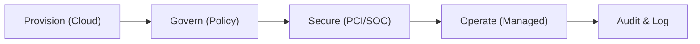

### 3. Distributed Financial Infrastructure Topology
Strategically orchestrating critical banking workloads across global regions, high-availability zones, and multi-cloud environments, providing a unified institutional view of global financial health and foundation readiness.

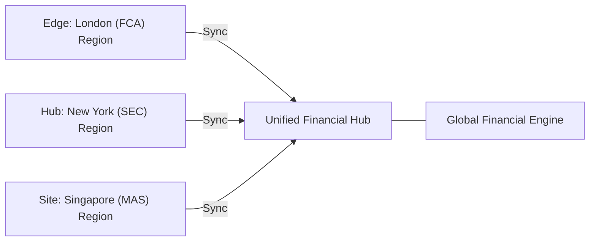

### 4. PCI-DSS & High-Trust Data Plane Protection Flow
Executing complex logic for securing the bridge between transaction processing systems and core banking ledgers, ensuring every organizational identity is verified and every financial access is according to institutional standards.

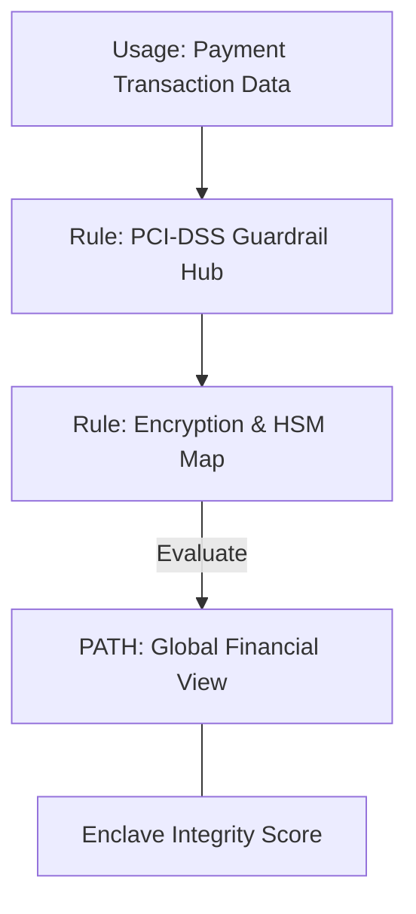

### 5. Multi-Jurisdiction Financial Governance & Compliance Flow
Automatically managing unified compliance standards across global financial regulators (SEC, FCA, BaFin, MAS), ensuring institutional data residency and security boundaries by default.

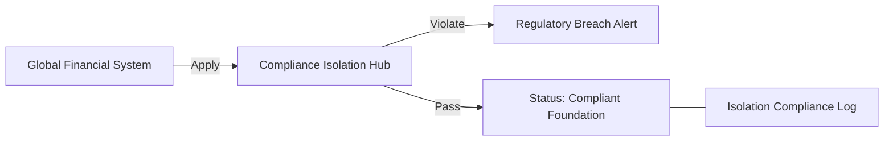

### 6. Encryption & Perimeter Protection Flow (FSI Standard)
Managing the lifecycle of a financial perimeter request, automatically enforcing institutional HSM-backed encryption and DDoS protection standards as required by security policy, ensuring zero-latency security confidence.

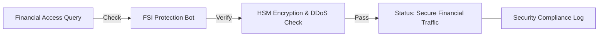

### 7. Institutional FSLZ Maturity Scorecard
Grading organizational performance based on key indicators: Security Coverage Grade, Compliance Adherence Index (PCI), and Operational Uptime Index.

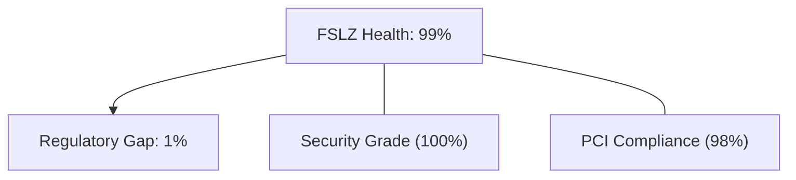

### 8. Identity & RBAC for Financial Governance
Managing fine-grained access to financial hubs, provisioning workers, and audit logs between Platform Architects, Compliance Auditors, and Treasury Operations.

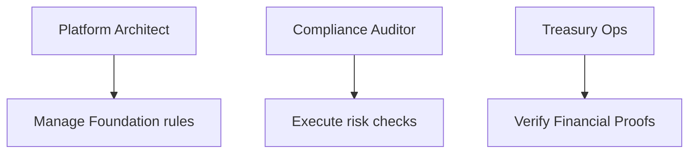

### 9. IaC Deployment: FSLZ-as-Code Framework
Using modular Terraform to deploy and manage the versioned distribution of the financial tracking hubs, enclave protection workers, and forensic metadata lakes.

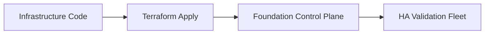

### 10. AIOps Financial Drift & Risk Validation Flow
Using advanced analytics to identify sudden surges in suspicious transactions, unauthorized infrastructure changes, suspicious configuration drifts, or unusual financial pattern changes that could result in institutional risk.

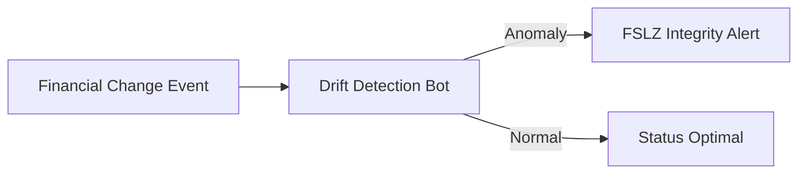

### 11. Metadata Lake for Forensic Financial Audit
Storing long-term records of every infrastructure change (metadata), every security event recorded, and every regulatory inquiry for institutional record-keeping, compliance auditing, and post-provisioning forensics.

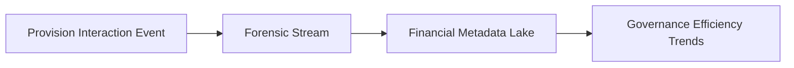

---

## 🏛️ Core Governance Pillars

1.  **Unified Foundation Coordination**: Maximizing resilience by centralizing all financial measurement through a single institutional plane.
2.  **Automated Tenant Provisioning**: Eliminating "manual foundation" scenarios through proactive orchestration and pattern verification.
3.  **Sequential Compliance Intelligence**: Ensuring zero-interruption operations through dependency-aware compliance-driven foundation engineering.
4.  **Zero-Trust Enclave Protection**: Automatically enforcing identity-based access and rule evaluation across all financial tiers.
5.  **Autonomous Operations Logic**: Guaranteeing reliability through automated industry-specific financial monitoring runbooks.
6.  **Full Financial Auditability**: Immutable recording of every infrastructure change and tenant provision for institutional forensics.

---

## 🛠️ Technical Stack & Implementation

### Foundation Engine & APIs
*   **Framework**: Python 3.11+ / FastAPI.
*   **Compliance Engine**: Custom Python-based logic for multi-cloud financial provisioning and DORA-style risk metrics.
*   **Integrations**: Native connectors for Azure FSI Hubs, AWS Financial Hubs, and regional regulators (SEC/FCA/MAS).
*   **Persistence**: PostgreSQL (Foundation Ledger) and Redis (Live Tenant State).
*   **Auth Orchestrator**: Federated OIDC/SAML for least-privilege foundation management access.

### Governance Dashboard (UI)
*   **Framework**: React 18 / Vite.
*   **Theme**: Dark, Slate, Indigo (Modern high-fidelity financial aesthetic).
*   **Visualization**: D3.js for financial topologies and Recharts for compliance velocity analytics.

### Infrastructure & DevOps
*   **Runtime**: AWS EKS or Azure Kubernetes Service (AKS) for management plane.
*   **Financial Hub**: Managed event sourcing for immutable financial security timeline reconstruction.
*   **IaC**: Modular Terraform for deploying the FSLZ landing zone and validation fleet.

---

## 🏗️ IaC Mapping (Module Structure)

| Module | Purpose | Real Services |
| :--- | :--- | :--- |
| **`infrastructure/fslz_hub`** | Central management plane | EKS, PostgreSQL, Redis |
| **`infrastructure/enforcers`** | Distributed foundation provisioners | Azure, AWS, GCP APIs |
| **`infrastructure/tenant_pipes`** | Foundation Ingestion Hubs | Webhooks, Lambda |
| **`infrastructure/auditing`** | Forensic financial sinks | S3, Athena, Quicksight |

---

## 🚀 Deployment Guide

### Local Principal Environment
```bash
# Clone the landing zone platform
git clone https://github.com/devopstrio/financial-services-lz.git
cd financial-services-lz

# Configure environment
cp .env.example .env

# Launch the FSLZ stack
make init

# Trigger a mock foundation update and automated compliance validation simulation
make simulate-fslz
```

Access the Management Portal at `http://localhost:3000`.

---

## 📜 License
Distributed under the MIT License. See `LICENSE` for more information.

---
<div align="center">
  <p>© 2026 Devopstrio. All rights reserved.</p>
</div>
